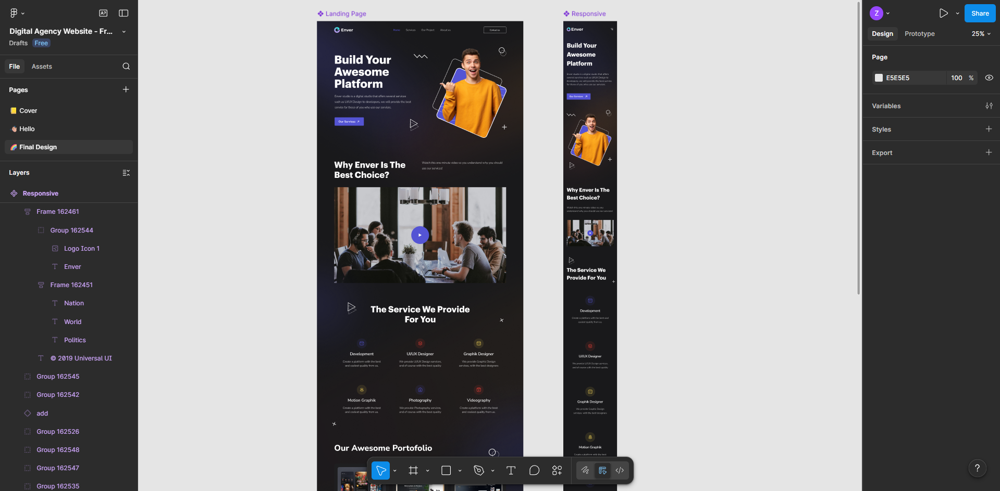
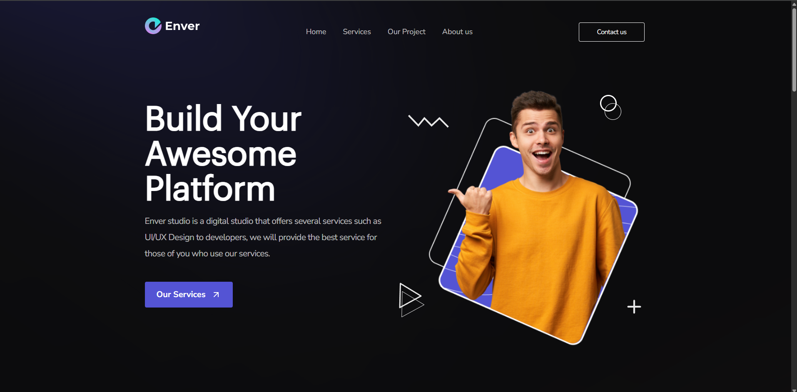

Landing page desenvolvida a partir de um protótipo de interface, com foco em responsividade, organização de layout e boas práticas de CSS.

O objetivo do projeto foi praticar construção de layouts modernos utilizando apenas HTML, CSS e Tailwind.

---

## Conceitos aplicados

- HTML5 semântico
- CSS Grid para estrutura principal
- Flexbox para alinhamentos internos
- Position (relative/absolute)
- Responsividade com a utility-first do tailwind
- Organização de código e separação de responsabilidades

---

##  Decisões técnicas

- Estrutura principal construída com Grid para melhor controle de seções
- Componentes internos organizados com Flexbox
- Abordagem mobile-first
- Alguns Breakpoints ajustados manualmente para manter fidelidade ao protótipo

---

## Preview

--- Preview do protótipo

--- Preview do site

---

## Como executar

Clone o repositório, acesse a paste e rode um `npm install` e depois um `npm run dev`
